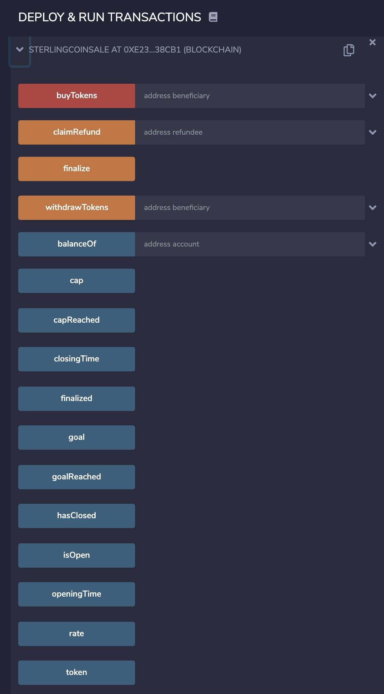

# SterlingCoin Crowdsale

## Introduction

SterlingCoin Crowdsale is a token crowdsale running from 08/21/2020 until 24 weeks later on the Kovan Ethereum testnet. It has a 1:1 exchange rate with ETH, with a goal of 100,000 wei and a cap of 1,000,000 wei. The reason for this low of an amount is to enable persons with low amounts of test ETH to be able to experiment with the deployed crowdsale contract (instructions on where the contract is saved and how to access it follow).

The crowdsale also allows refunds of any purchased tokens, so feel free to give that a try as well.

As you can see from the contract source code (found in this repo), this crowdsale contract is based off of the OpenZeppellin smart contract library and leverages their Crowdsale, MintedCrowdsale, CappedCrowdsale, TimedCrowdsale, and RefundablePostDeliveryCrowdsale contracts (among others).

The token itself is based on ERC20, adn also leverages the OpenZeppelin library, including their ERC20, ERC20Detailed and ERC20Mintable contracts.

## Additional information

This crowdsale contract is deployed on the Kovan testnet at address 0xc5F0c795769C03ea9B54a2573a13325e2D0AE3BA.

The hash for the transaction can be found here: https://kovan.etherscan.io/tx/0xb3209c23a7d24d8775706e2d28c5f11772a46b739cf0cb2df1f93f1d74956802.

The SterlingCoin token can be found at address 0x817169804EB1eba33a1F8D5A21d9130413ea3992, and the token crowdsale is stored at address 0xE23Db8A8EBBCcC2613144322A4d6b6e9BC738Cb1.

To participate in the crowdsale, you need to run the deployed contract from Remix (https://remix.ethereum.org) using the crowdsale address mentioned above, connecting through MetaMask or an equivalent middleware that allows your IDE to connect to the Kovan testnet.

